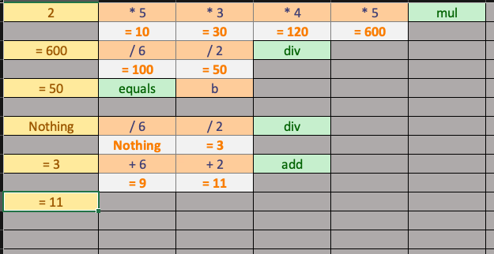

# qqc: Queue Queue Calculator
A calculator language inspired by JT's one hour programming language.
 - Video: [Building a programming language in an hour](https://www.youtube.com/watch?v=Zkd3mZYOOvw)
 - Code: [onehour](https://github.com/jntrnr/onehour)

I'm trying to get the composability of doing math in Lisp languages like Scheme, but without all the parentheses, and in RPN order.

So a qq file like this:
```
5 12 66 *
15 -
5 +
```

is equivalent to this equation:
```
((5 * 12 * 66) - 15 ) + 5
```

or this function in Scheme:
```
(+ (- (* 5 12 66) 15) 5)
```

Mockup design of eventual GUI:


## Running

To calculate a qq file:
```
cargo run -- examples/quadratic.qq
```
